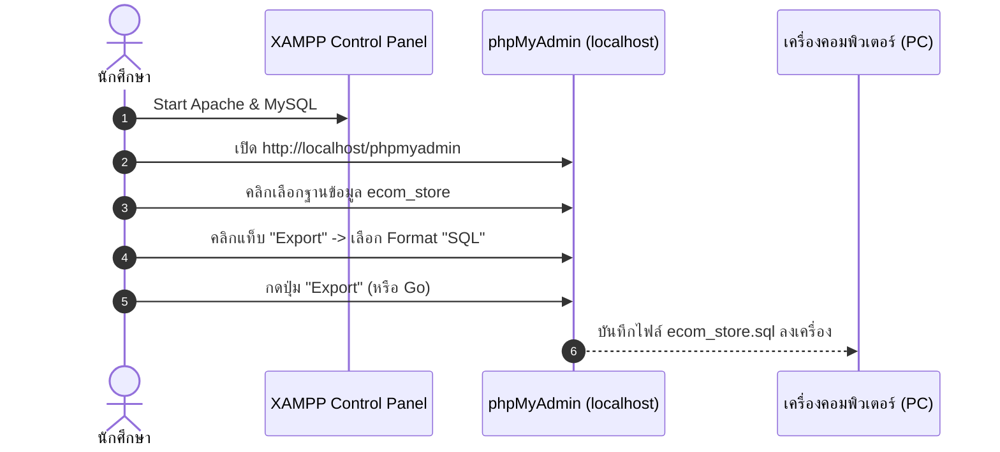

# บทที่ 1: การเตรียมไฟล์โปรเจกต์และ Export ฐานข้อมูลจาก XAMPP 📦💾

ในบทเรียนนี้ นักศึกษาจะได้เรียนรู้วิธีการสำรวจไฟล์โปรเจกต์บนเครื่องตนเอง และการส่งออกข้อมูลจากฐานข้อมูล MySQL (Local Database) ใน XAMPP ออกมาเป็นไฟล์ `.sql` เพื่อเตรียมนำขึ้นสู่เซิร์ฟเวอร์จริง

---

## 1.1 สำรวจโครงสร้างโปรเจกต์ในเครื่อง (`C:\xampp\htdocs\e-com`)

ก่อนอัปโหลด ให้เปิดดูโฟลเดอร์งานของตนเองที่ `C:\xampp\htdocs\e-com` (หรือชื่อโฟลเดอร์โปรเจกต์ของตนเอง) โดยควรมีโครงสร้างไฟล์หลักดังนี้:

```text
C:\xampp\htdocs\e-com\
├── admin\                   # โฟลเดอร์ระบบจัดการหลังบ้าน (Admin Panel)
│   ├── includes\            # header, footer ของหลังบ้าน
│   ├── categories.php       # จัดการหมวดหมู่
│   ├── products.php         # จัดการสินค้า
│   ├── product_add.php      # เพิ่มสินค้า
│   ├── orders.php           # จัดการคำสั่งซื้อ
│   └── users.php            # จัดการสมาชิก
├── assets\                  # ไฟล์สไตล์และสคริปต์
│   ├── css\custom.css
│   └── js\app.js
├── config\                  # โฟลเดอร์ตั้งค่าระบบ (สำคัญมาก!)
│   ├── app.php              # กำหนดชื่อเว็บ และ BASE_URL
│   ├── auth.php             # ระบบตรวจสอบสิทธิ์ล็อกอิน
│   └── database.php         # ข้อมูลเชื่อมต่อ MySQL Database
├── includes\                # header, footer ของหน้าบ้าน
├── uploads\                 # โฟลเดอร์เก็บรูปภาพสินค้า / สลิปโอนเงิน
│   └── products\
├── cart.php                 # ตะกร้าสินค้า
├── checkout.php             # ชำระเงิน / แนบสลิป
├── index.php                # หน้าแรกของเว็บไซต์
├── login.php                # เข้าสู่ระบบ
├── products.php             # รายการสินค้าทั้งหมด
├── product_detail.php       # รายละเอียดสินค้า
├── database.sql             # ไฟล์โครงสร้างฐานข้อมูลเริ่มต้น (ถ้ามี)
└── install.php              # สคริปต์ติดตั้งระบบ (ถ้ามี)
```

> [!NOTE]  
> หากในโปรเจกต์ของนักศึกษามีไฟล์ `database.sql` อยู่แล้ว และมีข้อมูลสินค้าตัวอย่างครบถ้วน สามารถใช้ไฟล์นี้สำหรับบทถัดไปได้ทันที แต่หากมีการเพิ่มสินค้าใหม่ๆ ในเครื่องแล้ว แนะนำให้ทำตามขั้นตอน Export ด้านล่าง

---

## 1.2 วิธี Export ฐานข้อมูล MySQL จาก XAMPP (phpMyAdmin)

หากนักศึกษาได้ทำการเพิ่มข้อมูลสินค้า หมวดหมู่ หรือทดสอบสั่งซื้อในเครื่องของตนเอง ให้ทำการ Export ข้อมูลล่าสุดตามขั้นตอนนี้:

### ขั้นตอนการ Export:

1. **เปิดโปรแกรม XAMPP Control Panel**
   - ตรวจสอบว่าโมดูล **Apache** และ **MySQL** อยู่ในสถานะสีเขียว (**Running**)
2. **เปิดเบราว์เซอร์แล้วเข้า phpMyAdmin**
   - พิมพ์ URL: [http://localhost/phpmyadmin](http://localhost/phpmyadmin)
3. **เลือกฐานข้อมูลของตนเอง**
   - ดูที่แถบเมนูด้านซ้าย แล้วคลิกเลือกฐานข้อมูลของโปรเจกต์ (เช่น `ecom_store`)
4. **ไปที่แท็บ Export (ส่งออก)**
   - คลิกแท็บ **Export** ที่เมนูด้านบน
   - ในหัวข้อ **Export method** ให้เลือกเป็น **Quick - display only the minimal options**
   - ในหัวข้อ **Format** ให้เลือกเป็น **SQL**
5. **กดปุ่ม Export (หรือ Go)**
   - เบราว์เซอร์จะดาวน์โหลดไฟล์ชื่อ `ecom_store.sql` (หรือ `<ชื่อฐานข้อมูล>.sql`) ลงในโฟลเดอร์ `Downloads` ของเครื่อง



---

## 1.3 ตรวจสอบความถูกต้องของไฟล์ `.sql`

ให้นำไฟล์ `.sql` ที่ดาวน์โหลดมา ตรวจสอบความเรียบร้อยดังนี้:
1. คลิกขวาที่ไฟล์ `.sql` แล้วเปิดด้วย **Notepad** หรือ **VS Code**
2. ตรวจสอบว่ามีคำสั่งสร้างตาราง (`CREATE TABLE`) ครบถ้วน เช่น:
   - `users`
   - `categories`
   - `products`
   - `orders`
   - `order_items`
   - `payments`
3. และมีคำสั่งเพิ่มข้อมูลตัวอย่าง (`INSERT INTO`) อยู่ในไฟล์

> [!TIP]  
> แนะนำให้เปลี่ยนชื่อไฟล์เป็น `database.sql` หรือ `backup_<รหัสนักศึกษา>.sql` และวางไว้ที่หน้า Desktop หรือโฟลเดอร์ที่หาง่าย เพื่อเตรียมนำไป Import ในบทที่ 2

---

## 1.4 เคลียร์ไฟล์ขยะในโฟลเดอร์โปรเจกต์ก่อนเริ่ม

ก่อนจะนำโปรเจกต์ไปบีบอัดเป็น `.zip` ในบทถัดไป ให้ตรวจสอบและลบไฟล์ที่ไม่จำเป็นออก เช่น:
- ❌ ไฟล์ `.zip` เก่าๆ ที่เคยแตกไว้ในโฟลเดอร์
- ❌ โฟลเดอร์ `.git` หรือไฟล์ temporary ต่างๆ (ถ้ามี)
- ❌ ไฟล์รูปภาพขนาดใหญ่ผิดปกติที่ไม่ได้ใช้งาน

---

### ➡️ ขั้นตอนถัดไป
เมื่อเตรียมไฟล์และได้ไฟล์ `database.sql` เรียบร้อยแล้ว ให้ไปต่อที่ ➡️ [**บทที่ 2: การสร้าง Database & User บน CloudPanel และ Import ข้อมูล**](./02-create-database-cloudpanel.md)
