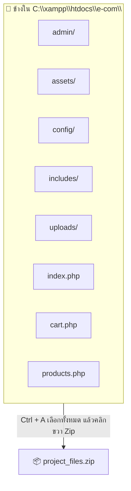
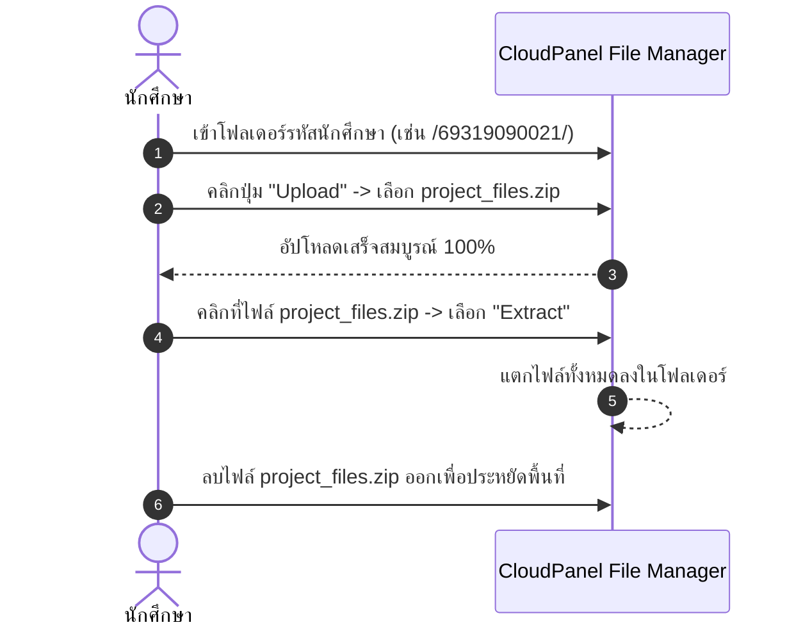

# บทที่ 3: การบีบอัดไฟล์และอัปโหลดผ่าน CloudPanel File Manager 📤📂

ในบทนี้ นักศึกษาจะได้เรียนรู้วิธีการบีบอัดไฟล์โปรเจกต์จากเครื่องคอมพิวเตอร์เป็นไฟล์ `.zip` อย่างถูกวิธี และการอัปโหลดไฟล์ขึ้นสู่โฟลเดอร์ประจำตัวบนเซิร์ฟเวอร์ผ่าน **CloudPanel File Manager** โดยไม่ต้องลงโปรแกรม FTP/SFTP ใดๆ

---

## 3.1 วิธีการบีบอัดไฟล์ (ZIP) ให้ถูกต้อง ⚠️ สำคัญมาก!

ข้อผิดพลาดที่พบบ่อยที่สุดของนักศึกษาคือ **"การคลิกขวาซิปที่โฟลเดอร์นอกสุด"** ซึ่งจะทำให้โครงสร้างโฟลเดอร์ซ้อนกัน เช่น `.../69319090021/e-com/index.php` ส่งผลให้หน้าเว็บเข้าตรงๆ ไม่ได้!

### ✅ วิธีที่ถูกต้อง (ทำตามนี้ 100%):

1. เปิดเข้าไป **ข้างใน** โฟลเดอร์ `C:\xampp\htdocs\e-com\`
2. กดคีย์ลัด **`Ctrl + A`** บนคีย์บอร์ด เพื่อเลือกไฟล์และโฟลเดอร์ข้างในทั้งหมด
3. คลิกขวาบนไฟล์ใดไฟล์หนึ่งที่เลือกไว้:
   * **Windows 11:** เลือก **Compress to ZIP file**
   * **Windows 10:** เลือก **Send to** ➡️ **Compressed (zipped) folder**
4. ตั้งชื่อไฟล์ zip เช่น `project_files.zip`

```text
❌ ผิด: ซิปโฟลเดอร์ 'e-com' จากด้านนอก -> ได้โฟลเดอร์ซ้อนกัน
✅ ถูก: เข้าไปข้างใน 'e-com' แล้วกด Ctrl+A -> บีบอัดเป็น .zip
```



---

## 3.2 เข้าสู่ CloudPanel File Manager

1. ล็อกอินเข้าสู่ CloudPanel: **[https://techniccom-cp.pichyy.qzz.io](https://techniccom-cp.pichyy.qzz.io)**
2. คลิกที่แท็บเมนู **Files** (ระบบจัดการไฟล์บนเว็บ)
3. นำทางเข้าไปยังโฟลเดอร์งานของตนเองตามลำดับ:
   * ดับเบิลคลิกเข้าโฟลเดอร์ **`htdocs`**
   * ดับเบิลคลิกเข้าโฟลเดอร์ **`lab.pichyy.qzz.io`**
   * ดับเบิลคลิกเข้าโฟลเดอร์ **`<รหัสนักศึกษา>`** (เช่น `69319090021`)

> [!IMPORTANT]  
> สังเกตแถบ Path ด้านบน ต้องแสดงว่าอยู่ในโฟลเดอร์รหัสของตนเอง:  
> `... / htdocs / lab.pichyy.qzz.io / 69319090021`

---

## 3.3 การอัปโหลดและแตกไฟล์ (Extract)



### ขั้นตอนการดำเนินการ:
1. **อัปโหลดไฟล์:**
   * คลิกที่ปุ่ม **Upload** (ที่มุมขวาบนของตารางไฟล์)
   * เลือกไฟล์ `project_files.zip` ที่สร้างไว้จากเครื่อง
   * รอให้แถบสถานะอัปโหลดเต็ม 100%
2. **แตกไฟล์ (Extract):**
   * คลิกขวาที่ไฟล์ `project_files.zip` บน File Manager (หรือคลิกที่ไอคอน 3 จุดท้ายแถว)
   * เลือกคำสั่ง **Extract**
   * ยืนยันการแตกไฟล์
3. **ลบไฟล์ ZIP ทิ้ง:**
   * เมื่อแตกไฟล์เสร็จแล้ว ให้คลิกขวาที่ไฟล์ `project_files.zip` แล้วเลือก **Delete** เพื่อไม่ให้เปลืองพื้นที่ดิสก์

---

## 3.4 ตรวจสอบความถูกต้องของไฟล์หลังแตก

ตรวจสอบว่าภายในโฟลเดอร์ `<รหัสนักศึกษา>` มีไฟล์เหล่านี้อยู่โดยตรง (ไม่อยู่ในโฟลเดอร์ซ้อน):
- 📁 `admin/`
- 📁 `assets/`
- 📁 `config/`
- 📁 `includes/`
- 📁 `uploads/`
- 📄 `index.php`
- 📄 `cart.php`
- 📄 `checkout.php`
- 📄 `products.php`

---

### ➡️ ขั้นตอนถัดไป
เมื่อไฟล์ทั้งหมดขึ้นสู่เซิร์ฟเวอร์เรียบร้อยแล้ว ให้ไปต่อที่ ➡️ [**บทที่ 4: การแก้ไขไฟล์ Configuration (database.php และ app.php)**](./04-configure-php-app.md)
