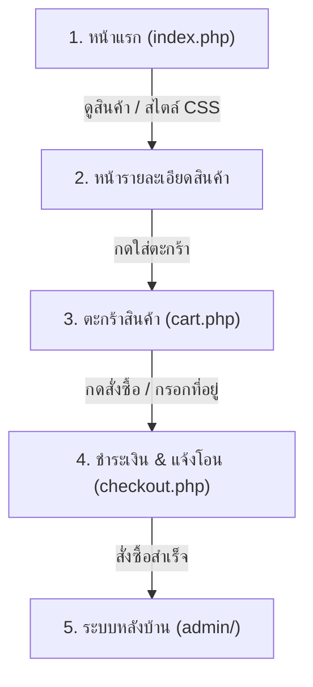

# บทที่ 5: การทดสอบระบบและการแก้ปัญหาที่พบบ่อย (Troubleshooting) 🔍🛠️

ในบทนี้ นักศึกษาจะได้ทดสอบการทำงานของเว็บไซต์บนสภาพแวดล้อมออนไลน์จริง และเรียนรู้วิธีการวินิจฉัยรวมถึงแก้ไขข้อผิดพลาด (Errors) ที่พบบ่อยด้วยตนเอง

---

## 5.1 ขั้นตอนการทดสอบฟังก์ชันสำคัญของเว็บไซต์

เปิดเว็บเบราว์เซอร์แล้วเข้าไปยัง URL ของตนเอง:  
👉 **`https://lab.pichyy.qzz.io/<รหัสนักศึกษา>`** *(เช่น `https://lab.pichyy.qzz.io/69319090021`)*

### 🧪 แบบทดสอบ 5 จุดสำคัญ:

1. **หน้าแรก (Homepage):**
   - ตรวจสอบว่าโลโก้ สีสัน CSS และ Font แสดงผลสวยงาม ไม่แตก
   - ตรวจสอบว่ารูปภาพสินค้าแสดงผลครบถ้วน
2. **ระบบสมาชิก (Auth):**
   - ทดสอบสมัครสมาชิกใหม่ (`register.php`)
   - ทดสอบเข้าสู่ระบบ (`login.php`) และออกจากระบบ (`logout.php`)
3. **ระบบสั่งซื้อสินค้า (E-Commerce Flow):**
   - เลือกสินค้า -> กดปุ่ม "ใส่ตะกร้า"
   - ไปที่หน้าตะกร้า (`cart.php`) -> ตรวจสอบยอดรวมราคาสินค้า
   - ดำเนินการสั่งซื้อ (`checkout.php`) -> บันทึกคำสั่งซื้อสำเร็จ
4. **ระบบจัดการหลังบ้าน (Admin Panel):**
   - เข้าสู่ระบบ Admin ผ่าน `https://lab.pichyy.qzz.io/<รหัสนักศึกษา>/admin`
   - ทดลองเพิ่มสินค้าใหม่ 1 รายการ พร้อมอัปโหลดรูปภาพ
   - ตรวจสอบรายการคำสั่งซื้อที่เพิ่งสั่งเข้ามา

---

## 5.2 คู่มือการแก้ไขปัญหาที่พบบ่อย (Troubleshooting Guide)

| อาการของปัญหา | สาเหตุที่เป็นไปได้ | วิธีแก้ไข (Action to Fix) |
| :--- | :--- | :--- |
| **Database Connection Error (1045 - Access denied)** | ระบุ User หรือ Password ใน `config/database.php` ผิด | 1. เปิดดูรหัสผ่านที่จดไว้ตอนสร้างในบทที่ 2 2. เข้าไปแก้ `DB_USER` และ `DB_PASS` ใน `config/database.php` ให้ถูกต้อง |
| **Database Connection Error (1049 - Unknown database)** | ระบุชื่อ Database ใน `config/database.php` ผิด | ตรวจสอบชื่อในเมนู **Databases** บน CloudPanel ว่าสะกดตรงกันหรือไม่ (เช่น `db_69319090021`) |
| **หน้าเว็บขาวโล่ง หรือ Error 500 (Internal Server Error)** | มี Syntax Error ในไฟล์ PHP เช่น ลืมเครื่องหมาย `;` หรือลืมปิดปีกกา `}` | 1. ตรวจสอบไฟล์ล่าสุดที่แก้ไข (`database.php` หรือ `app.php`) 2. เช็กว่าใส่เครื่องหมายคำพูดเดี่ยว `'...'` ครบทั้งเปิดและปิด |
| **หน้าเว็บตัวหนังสือธรรมดา ไม่มีสี CSS / รูปภาพไม่ขึ้น (404)** | ลืมแก้ `BASE_URL` ใน `config/app.php` | 1. เปิดไฟล์ `config/app.php` 2. แก้ `define('BASE_URL', '/<รหัสนักศึกษา>');` 3. สังเกตว่าต้องมี `/` นำหน้า แต่ไม่มี `/` ต่อท้าย |
| **อัปโหลดรูปสินค้าแล้วรูปไม่บันทึก / Error** | ไม่มีโฟลเดอร์ `uploads/products/` บนเซิร์ฟเวอร์ | 1. เข้า CloudPanel File Manager 2. สร้างโฟลเดอร์ `uploads` และข้างในสร้าง `products` |
| **เข้าหน้าเว็บแล้วขึ้น Directory Listing (เห็นรายการไฟล์แทนหน้าเว็บ)** | ไม่มีไฟล์ `index.php` อยู่ในโฟลเดอร์รหัสนักศึกษาโดยตรง (เกิดจากการซิปซ้อนโฟลเดอร์) | ย้ายไฟล์ทั้งหมดที่อยู่ในโฟลเดอร์ย่อย ออกมาไว้ที่โฟลเดอร์ `<รหัสนักศึกษา>` โดยตรง |
| **ล็อกอิน Admin ไม่ผ่าน** | ไม่มีข้อมูล Admin ในฐานข้อมูล หรือจำรหัสไม่ได้ | เปิด phpMyAdmin บน CloudPanel เข้าไปดูที่ตาราง `users` เช็ก username และ password ของผู้ใช้ที่มี role เป็น `admin` |

---

## 5.3 ตัวอย่างการตรวจสอบ Error ผ่าน Developer Tools (F12)

หากพบว่ารูปภาพไม่ขึ้นหรือปุ่มกดไม่ทำงาน:
1. กดปุ่ม **`F12`** บนคีย์บอร์ด หรือคลิกขวาเลือก **Inspect (ตรวจสอบ)**
2. คลิกที่แท็บ **Console** หรือ **Network**
3. หากมีแถบสีแดงขึ้นว่า `404 Not Found` ให้ดูที่ URL ปลายทาง:
   - ถ้า URL ยังชี้ไปที่ `https://lab.pichyy.qzz.io/e-com/...` แสดงว่า **`BASE_URL` ใน `config/app.php` ยังไม่ได้แก้**

---

### ➡️ ขั้นตอนถัดไป
เมื่อระบบทำงานได้สมบูรณ์และไม่มี Error แล้ว ให้ไปต่อที่ ➡️ [**บทที่ 6: เช็กลิสต์ตรวจสอบความเรียบร้อยก่อนส่งงานอาจารย์**](./06-submission-checklist.md)
