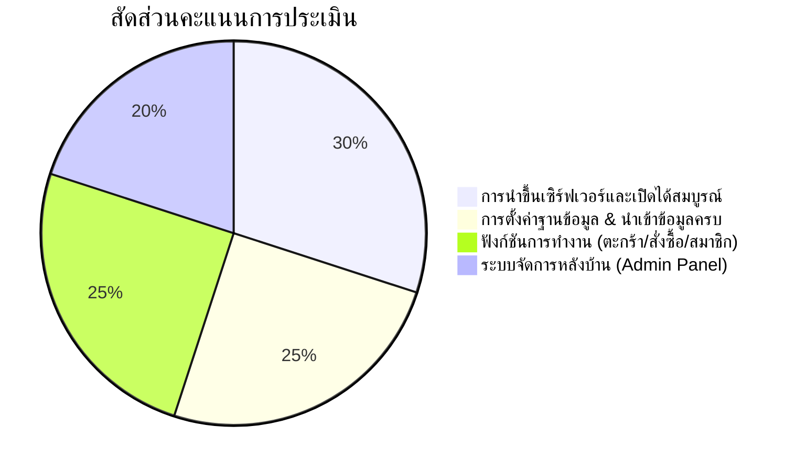

# บทที่ 6: เช็กลิสต์ตรวจสอบความเรียบร้อยก่อนส่งงานอาจารย์ ✅📋

ยินดีด้วยที่นักศึกษาดำเนินการติดตั้งและตั้งค่าเว็บไซต์บนเซิร์ฟเวอร์เสร็จสิ้น! ก่อนที่จะส่งลิงก์ให้อาจารย์ผู้สอนตรวจให้คะแนน ขอให้นักศึกษาตรวจสอบความถูกต้องตามเช็กลิสต์ 10 ข้อด้านล่างนี้

---

## 6.1 ตารางเช็กลิสต์ตรวจผลงานตนเอง (Self-Checklist 10 ข้อ)

| ลำดับ | รายการตรวจสอบ | วิธีทดสอบ | ผ่าน (✔️) |
| :---: | :--- | :--- | :---: |
| **1** | **เปิดหน้าเว็บผ่านอินเทอร์เน็ตได้จริง** | ลองเปิด `https://lab.pichyy.qzz.io/<รหัสนักศึกษา>` ผ่านสมาร์ตโฟนหรือคอมพิวเตอร์อื่น โดยไม่ต้องต่อ Wi-Fi ที่บ้าน | 🔲 |
| **2** | **หน้าเว็บสวยงาม ไม่แตก** | ตรวจสอบว่า CSS, สี, ฟอนต์, ไอคอน และเลย์เอาต์แสดงผลถูกต้อง | 🔲 |
| **3** | **ไม่มี Error ฐานข้อมูล** | หน้าแรกสามารถดึงข้อมูลสินค้าจาก MySQL มาแสดงผลได้ครบถ้วน | 🔲 |
| **4** | **`BASE_URL` ถูกต้อง** | ลิงก์ทุกปุ่มในเว็บไซต์ (เช่น ปุ่มหมวดหมู่, ปุ่มดูรายละเอียด) พาไปยัง URL ที่ถูกต้อง ไม่หลุดไป `/e-com` | 🔲 |
| **5** | **ระบบสมาชิกทำงานได้** | สามารถสมัครสมาชิกใหม่ และล็อกอินเข้าสู่ระบบได้จริง | 🔲 |
| **6** | **ระบบสั่งซื้อสมบูรณ์** | สามารถเลือกสินค้า กดใส่ตะกร้า คำนวณราคาถูกต้อง และบันทึกคำสั่งซื้อได้ | 🔲 |
| **7** | **ระบบหลังบ้าน (Admin) เข้าได้** | สามารถเข้าหน้า `https://lab.pichyy.qzz.io/<รหัสนักศึกษา>/admin` และล็อกอินด้วยสิทธิ์ผู้ดูแลระบบได้ | 🔲 |
| **8** | **อัปโหลดรูปภาพสินค้าได้** | ลองเพิ่มสินค้าใหม่ในหน้า Admin พร้อมใส่รูปภาพ และรูปแสดงผลได้จริง | 🔲 |
| **9** | **ลบไฟล์ขยะเรียบร้อย** | ลบไฟล์ `project_files.zip` ออกจากเซิร์ฟเวอร์แล้ว | 🔲 |
| **10** | **มีชื่อและรหัสใน Student Hub** | เข้า [https://lab.pichyy.qzz.io](https://lab.pichyy.qzz.io) แล้วค้นหารหัสนักศึกษาของตนเอง และคลิกลิงก์เข้ามายังเว็บได้ถูกต้อง | 🔲 |

---

## 6.2 ข้อมูลที่ต้องเตรียมส่งให้อาจารย์ผู้สอน

เมื่อตรวจสอบผ่านครบทั้ง 10 ข้อแล้ว ให้เตรียมข้อมูลส่งงานตามรูปแบบนี้:

```text
==================================================
แบบฟอร์มส่งงาน: การนำเว็บไซต์ขึ้น CloudPanel Server
==================================================
- รหัสนักศึกษา: 693190900xx
- ชื่อ-นามสกุล: นาย/นางสาว ....................
- URL หน้าเว็บผลงาน: https://lab.pichyy.qzz.io/693190900xx
- บัญชี Admin สำหรับอาจารย์ทดสอบ:
  * Username: admin
  * Password: ....................
- บัญชี User สมาชิกทั่วไป:
  * Username: user / test
  * Password: ....................
==================================================
```

---

## 6.3 เกณฑ์การให้คะแนน (Rubric 100 คะแนน)



1. **การ Deploy และการตั้งค่าพื้นฐาน (30 คะแนน):**
   - เว็บไซต์เปิดได้จริงผ่านโดเมนสาธารณะ ไม่เกิด Error 500 หรือ 404
   - การกำหนด `BASE_URL` ถูกต้อง ลิงก์ไม่ผิดพลาด
2. **การจัดการฐานข้อมูล MySQL (25 คะแนน):**
   - มีการสร้าง Database & User บน CloudPanel อย่างถูกต้อง
   - ข้อมูลตาราง โครงสร้าง และข้อมูลสินค้าตัวอย่าง Import ครบถ้วน
3. **ฟังก์ชันการทำงานของเว็บไซต์ (25 คะแนน):**
   - ระบบหน้าแรก แสดงสินค้า แยกหมวดหมู่
   - ระบบตะกร้าสินค้าและการสั่งซื้อ (Checkout Flow)
   - ระบบสมัครสมาชิกและการเข้าสู่ระบบ
4. **ระบบบริหารจัดการหลังบ้าน (20 คะแนน):**
   - เพิ่ม/แก้ไข/ลบ สินค้าและหมวดหมู่ได้
   - การอัปโหลดไฟล์ภาพสินค้าลงโฟลเดอร์ `uploads/`
   - ตรวจสอบรายการสั่งซื้อของลูกค้าได้

---

🎉 **ขอแสดงความยินดีกับนักศึกษาทุกคนที่สำเร็จการฝึกปฏิบัติการนำเว็บไซต์ขึ้นสู่ Production Server!**
