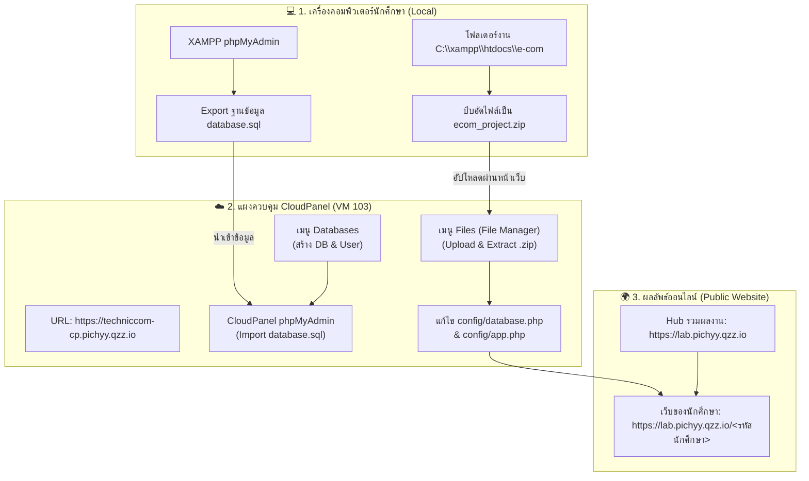

# คู่มือการนำเว็บไซต์ e-Commerce (PHP & MySQL) ขึ้นสู่เซิร์ฟเวอร์ CloudPanel 🌐🚀

> **รายวิชา:** (31909-0003) การสร้างเว็บไซต์และระบบฐานข้อมูล  
> **อาจารย์ผู้สอน:** อาจารย์พิชญุตย์ สมบุญ  
> **ระดับชั้น / กลุ่มเรียน:** นักศึกษาสาขาเทคโนโลยีสารสนเทศ / คอมพิวเตอร์ธุรกิจ

ยินดีต้อนรับนักศึกษาทุกคนเข้าสู่คู่มือปฏิบัติการการนำเว็บไซต์ที่พัฒนาด้วย **PHP + MySQL (XAMPP)** จากเครื่องคอมพิวเตอร์ของตนเอง ขึ้นไปติดตั้งและเปิดใช้งานจริงบนเซิร์ฟเวอร์สาธารณะด้วยระบบจัดการ **CloudPanel** โดยใช้เพียงเว็บเบราว์เซอร์เครื่องเดียว ไม่จำเป็นต้องติดตั้งโปรแกรมเสริมใดๆ เพิ่มเติม!

---

## 🎯 วัตถุประสงค์การเรียนรู้
1. เข้าใจสถาปัตยกรรมและขั้นตอนการ Deploy เว็บแอปพลิเคชันจากสภาพแวดล้อม Local (XAMPP) ขึ้นสู่ Production Server
2. สามารถส่งออก (Export) ฐานข้อมูล MySQL และนำเข้า (Import) สู่เซิร์ฟเวอร์จริงได้ถูกต้อง
3. สามารถจัดการไฟล์เว็บไซต์ผ่านระบบ CloudPanel File Manager ได้อย่างคล่องแคล่ว
4. สามารถแก้ไขค่า Configuration ของแอปพลิเคชัน (`database.php` และ `app.php`) ให้สอดคล้องกับ Production URL และสิทธิ์การเข้าถึง
5. สามารถตรวจสอบ ทดสอบ และแก้ไขปัญหาข้อผิดพลาด (Troubleshooting) ที่พบบ่อยได้ด้วยตนเอง

---

## 🏗️ ภาพรวมสถาปัตยกรรมระบบ (Architecture Overview)

---

## 📚 สารบัญบทเรียนทีละขั้นตอน (Step-by-Step Lessons)

คลิกเลือกศึกษาตามลำดับขั้นตอนเพื่อความเข้าใจที่ถูกต้อง:

1. 📦 [**บทที่ 1: การเตรียมไฟล์โปรเจกต์และ Export ฐานข้อมูลจาก XAMPP**](./01-prepare-and-export-db.md)
   - ตรวจสอบโฟลเดอร์โปรเจกต์ในเครื่อง
   - การ Export ฐานข้อมูลจาก phpMyAdmin ในเครื่อง
2. 🗄️ [**บทที่ 2: การสร้าง Database & User บน CloudPanel และ Import ข้อมูล**](./02-create-database-cloudpanel.md)
   - ล็อกอินเข้า CloudPanel ด้วยรหัสนักศึกษา
   - การสร้าง Database และ Database User
   - การ Import ไฟล์ `.sql` ผ่าน CloudPanel phpMyAdmin
3. 📤 [**บทที่ 3: การบีบอัดไฟล์และอัปโหลดผ่าน CloudPanel File Manager**](./03-upload-files-filemanager.md)
   - การเลือกคลุมไฟล์และบีบอัดเป็น `.zip` อย่างถูกต้อง (ไม่ซิปซ้อนโฟลเดอร์)
   - การอัปโหลดและกดคำสั่ง Extract เข้าโฟลเดอร์รหัสนักศึกษา
4. ⚙️ [**บทที่ 4: การแก้ไขไฟล์ Configuration (database.php และ app.php)**](./04-configure-php-app.md)
   - ปรับแต่ง `config/database.php` ให้ตรงกับฐานข้อมูลบนเซิร์ฟเวอร์
   - ปรับแต่ง `config/app.php` เปลี่ยน `BASE_URL` เป็นรหัสนักศึกษา
5. 🔍 [**บทที่ 5: การทดสอบระบบและการแก้ปัญหาที่พบบ่อย (Troubleshooting)**](./05-test-and-troubleshooting.md)
   - แนวทางการทดสอบระบบตะกร้าสินค้า สั่งซื้อ และหน้า Admin
   - วิธีแก้ Database Connection Error, 404 Not Found, 500 Server Error
6. ✅ [**บทที่ 6: เช็กลิสต์ตรวจสอบความเรียบร้อยก่อนส่งงานอาจารย์**](./06-submission-checklist.md)
   - 10 ข้อตรวจทานเพื่อความสมบูรณ์ 100%
   - เกณฑ์การให้คะแนนการทดสอบระบบ
7. ⚡ [**ใบสรุปย่อ 1 หน้าจบ (Quick Cheat Sheet)**](./quick-cheatsheet.md)
   - สรุปกระชับ 5 นาที สำหรับทบทวนขั้นตอนอย่างรวดเร็ว

---

## 🔑 ข้อมูลการเข้าใช้งานสำหรับนักศึกษา (Credentials & URLs)

| รายการ | ข้อมูล URL / บัญชี | หมายเหตุ |
| :--- | :--- | :--- |
| **CloudPanel Web Control Panel** | [https://techniccom-cp.pichyy.qzz.io](https://techniccom-cp.pichyy.qzz.io) | แผงควบคุมจัดการไฟล์และฐานข้อมูล |
| **Student Project Hub** | [https://lab.pichyy.qzz.io](https://lab.pichyy.qzz.io) | ศูนย์รวมผลงานรายวิชา (ค้นหารหัสนักศึกษาได้) |
| **Username ในการล็อกอิน** | `std<รหัสนักศึกษา>` | เช่น `std69319090021` |
| **Password ในการล็อกอิน** | `Std@<รหัสนักศึกษา>` | เช่น `Std@69319090021` |
| **โฟลเดอร์ประจำตัวบนเซิร์ฟเวอร์** | `/home/lab-pichyy/htdocs/lab.pichyy.qzz.io/<รหัสนักศึกษา>/` | วางไฟล์ในโฟลเดอร์นี้เท่านั้น |

---

## 👥 ตารางรายชื่อนักศึกษาและ URL ประจำตัว (19 คน)

| ลำดับ | รหัสนักศึกษา | ชื่อ - นามสกุล | URL ผลงานของนักศึกษา | โฟลเดอร์งาน |
| :---: | :---: | :--- | :--- | :--- |
| 1 | `69319090021` | นางสาวกาญจน์เกล้า แซ่ลิ้ม | [https://lab.pichyy.qzz.io/69319090021](https://lab.pichyy.qzz.io/69319090021) | `/69319090021/` |
| 2 | `69319090022` | นางสาวฐิติพร เจริญสลุง | [https://lab.pichyy.qzz.io/69319090022](https://lab.pichyy.qzz.io/69319090022) | `/69319090022/` |
| 3 | `69319090023` | นายทักษดนย์ ชูชื่น | [https://lab.pichyy.qzz.io/69319090023](https://lab.pichyy.qzz.io/69319090023) | `/69319090023/` |
| 4 | `69319090024` | นายทินภัทร มะนาวหวาน | [https://lab.pichyy.qzz.io/69319090024](https://lab.pichyy.qzz.io/69319090024) | `/69319090024/` |
| 5 | `69319090025` | นางสาวธันย์ชนก ทับทิมทอง | [https://lab.pichyy.qzz.io/69319090025](https://lab.pichyy.qzz.io/69319090025) | `/69319090025/` |
| 6 | `69319090026` | นายธีรพันธ์ เต็งน้อย | [https://lab.pichyy.qzz.io/69319090026](https://lab.pichyy.qzz.io/69319090026) | `/69319090026/` |
| 7 | `69319090027` | นายนครินทร์ แก้วโสตย | [https://lab.pichyy.qzz.io/69319090027](https://lab.pichyy.qzz.io/69319090027) | `/69319090027/` |
| 8 | `69319090028` | นายปัญญพัฒน์ บุญเกตุ | [https://lab.pichyy.qzz.io/69319090028](https://lab.pichyy.qzz.io/69319090028) | `/69319090028/` |
| 9 | `69319090029` | นางสาวปิยธิดา บุตรนิน | [https://lab.pichyy.qzz.io/69319090029](https://lab.pichyy.qzz.io/69319090029) | `/69319090029/` |
| 10 | `69319090030` | นายพิทวัส วงค์ตาเขียว | [https://lab.pichyy.qzz.io/69319090030](https://lab.pichyy.qzz.io/69319090030) | `/69319090030/` |
| 11 | `69319090031` | นายพีรพัฒน์ พาหุรัตน์ | [https://lab.pichyy.qzz.io/69319090031](https://lab.pichyy.qzz.io/69319090031) | `/69319090031/` |
| 12 | `69319090032` | นายภาณุวัฒน์ ปั่นสันเที่ยะ | [https://lab.pichyy.qzz.io/69319090032](https://lab.pichyy.qzz.io/69319090032) | `/69319090032/` |
| 13 | `69319090033` | นายภานุวัฒน์ ยิ้มพ่วง | [https://lab.pichyy.qzz.io/69319090033](https://lab.pichyy.qzz.io/69319090033) | `/69319090033/` |
| 14 | `69319090034` | นายรชต เปลี่ยนศรี | [https://lab.pichyy.qzz.io/69319090034](https://lab.pichyy.qzz.io/69319090034) | `/69319090034/` |
| 15 | `69319090035` | นายศิรศักดิ์ ม่วงงาม | [https://lab.pichyy.qzz.io/69319090035](https://lab.pichyy.qzz.io/69319090035) | `/69319090035/` |
| 16 | `69319090036` | นายศิวา พุทธโชติ | [https://lab.pichyy.qzz.io/69319090036](https://lab.pichyy.qzz.io/69319090036) | `/69319090036/` |
| 17 | `69319090037` | นายศุภกร แสงจันทร์ | [https://lab.pichyy.qzz.io/69319090037](https://lab.pichyy.qzz.io/69319090037) | `/69319090037/` |
| 18 | `69319090038` | นางสาวโสธิตา มีผล | [https://lab.pichyy.qzz.io/69319090038](https://lab.pichyy.qzz.io/69319090038) | `/69319090038/` |
| 19 | `69319090039` | นายอนาวินทร์ แก้วเก้า | [https://lab.pichyy.qzz.io/69319090039](https://lab.pichyy.qzz.io/69319090039) | `/69319090039/` |

---

> [!TIP]  
> **พร้อมแล้วใช่ไหม?** เริ่มต้นศึกษาบทเรียนแรกได้เลยที่ ➡️ [**บทที่ 1: การเตรียมไฟล์โปรเจกต์และ Export ฐานข้อมูลจาก XAMPP**](./01-prepare-and-export-db.md)
